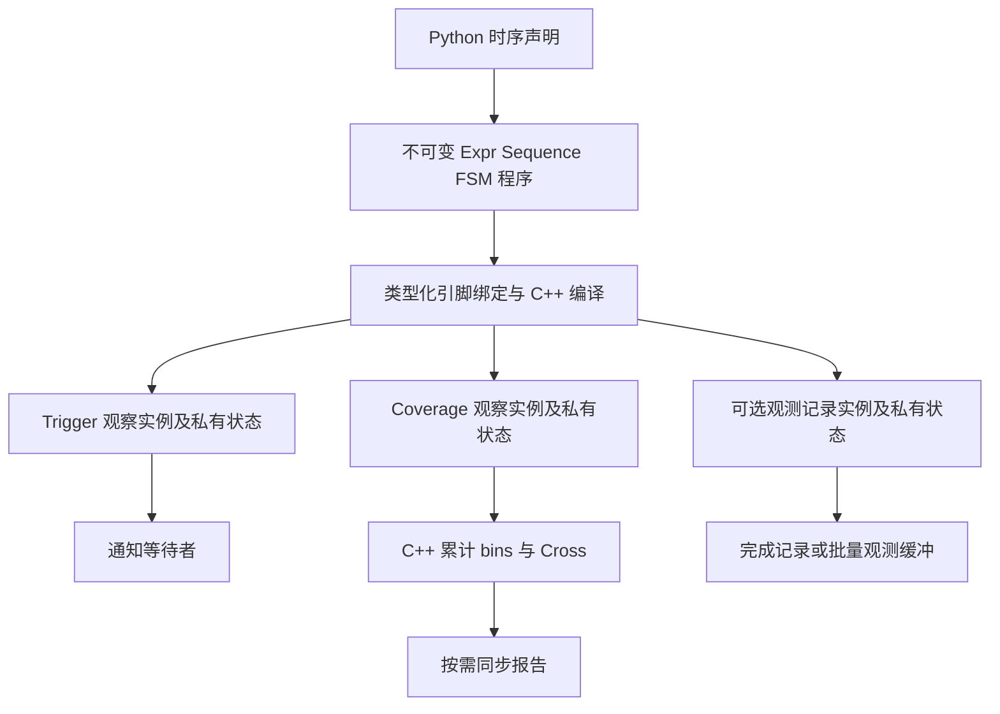
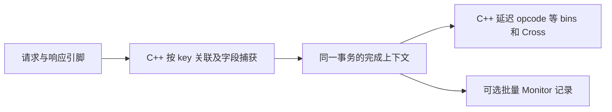

# Coverage v2 共享时序程序与 C++ 执行设计草稿

状态：讨论稿，2026-10-08，目标接口尚未实现。设计与代码实验位于 `/tmp/xreactor-coverage-v2-ob2uhbua/xreactor` 的 `coverage-v2` 分支。本文更新时序覆盖方向；现有运行示例仍以[实验指南](../../docs/guides/coverage-v2.md)为准。

**同一份时序定义可以用于等待、持续计数或生成观测记录。C++ 负责连续采样、时序推进和计数；Python 负责类声明、类型检查、绑定和报告。** 新设计按这些目标向 xcomm 提出引擎需求，包含每个 bin 的完整时序程序和原生事务关联。现有 ABI v3 用来说明实现起点。

## 从同一个时序定义理解 trigger 和 coverage

候选接口中的 ProtocolPins 是具有符号运算类型信息的引脚视图，叶节点区分布尔和整数信号，并保留原生信号句柄。该视图在定义或绑定阶段使用，不进入逐拍 Python 热路径。它需要补全类型契约；当前运行示例只包含 W/U/Set 的 Pin 协议，还不能直接用于严格检查下列声明函数。

假设一个接口同时最多只有一笔未完成请求，定义“请求握手后，接下来 1 至 4 拍出现响应握手”：

```python
@xtrigger(sample=RisingEdge("clock"))
def roundtrip(pins: ProtocolPins):
    return Sequence(
        Wait(pins.request.valid & pins.request.ready),
        Within(1, 4, pins.response.valid & pins.response.ready),
    )
```

Trigger 使用这个定义等待一次完成：

```python
await roundtrip(pins)
```

Coverage 使用相同定义持续累计完成次数。以下是拟议接口，没有实际导出：

```python
class RoundTripPoint(TemporalCoverPoint[ProtocolPins]):
    within_four_cycles = Bin.pattern(roundtrip)


@covergroup(schema_id="protocol.roundtrip")
class ProtocolCoverage(SignalCoverGroup[ProtocolPins]):
    roundtrip = RoundTripPoint()


coverage = ProtocolCoverage(instance="dut.protocol")
coverage.bind(
    pins=pins,
    sample=RisingEdge(pins.clock),
    strategy="native",
)
# Execution 仍负责启动、同步与释放这个 coverage 实例。
```

Point 的类属性给 bin 命名，Group 的类属性给 point 命名，`roundtrip` 对象引用说明匹配什么过程。用户不用重写时序表达式或手动给 bin 加计数，也不用为每个 bin 编写循环 await 的任务。

`SignalCoverGroup[P]` 的 P 是类型化引脚组，可以容纳 clock 和 XData；当前 `CoverGroup[S]` 的 S 是不可变观测样本。两者采用明确的输入类型，避免把含有引脚对象的 dataclass 当作可手动 sample 的标量快照。候选名称可以调整，这个类型边界需要保留。既有值覆盖和 Python 事务 sample 路径继续使用 `CoverGroup[S]`。

`@xtrigger` 提供时序声明入口。其声明对象保存程序、参数和采样信息，绑定后才创建观察实例。覆盖编译器读取这份定义，不调用它的 await，也不接收已经 arm 的 watcher。装饰器的静态返回类型应明确区分声明对象与绑定后的 trigger，保留 ProtocolPins 的参数类型和 IDE 补全。

## 当前 C++ 已经有的关联

本机 xcomm 源码在 `/home/xyl/picker/dependence/xcomm`，隔离 binding 构建在 `/tmp/xreactor-coverage-native-build`，coverage ABI 为 3。实现关系如下：

| 位置 | 当前作用 |
| --- | --- |
| `include/xspcomm/xtrigger.h` 的 `XTriggerEngine` | 同一个引擎包含 watcher、表达式、Sequence/FSM 和 coverage 描述符 |
| `src/xtrigger.cpp` 的 `AppendHit` | 普通 watcher 产生通知并解除 armed；带 coverage 的 watcher 调用 SampleCoverage，继续观察 |
| `AdvanceSequence` 和 `AdvanceFsm` | trigger 与 coverage 共用步骤或状态推进函数 |
| `AdvanceCoverageAttempts` | 共享程序，每个并发匹配保存独立 MatchState |
| `SampleCoverage` | 在 C++ 准备 bins、Cross 和计数增量后提交累计值 |
| `AttachCoverage` | 把整组覆盖定义附到已有 handle；当前 bin.steps 只接受 Wait/Next |
| `CoverageSnapshot` | 返回累计计数和可选诊断，不依赖普通命中逐次通知 Python |

Python 的 [coverage adapter](../../src/xreactor/_coverage_runtime.py) 已把 `Bin.transition(a, b, c)` 降低为 `Sequence(Wait(value == a), Next(value == b), Next(value == c))`，并调用 [backend 的时序降低入口](../../src/xreactor/backend.py)。

所以当前覆盖率热路径确实在 C++，但还有 Python 手动 sample 和 Python fallback 路径。类声明前端不改变这个事实。目标是在已有共用基础上整理编译与观察接口，并扩展 C++ 能力。

2026-10-08 的 binding 探针使用相同 Wait/Within 程序注册两份独立观察状态：普通通知一次时 coverage 计数为 1；释放通知观察后，再运行四个周期，coverage 计数变为 3，没有新增通知。注销后 ActiveCount 为 0。相同程序放入 ABI v3 的 bin.steps 被明确拒绝。原始结果保存在 `/tmp/xreactor-coverage-v2-ob2uhbua/pattern-native-baseline.json`。这些结果验证当前机制，不代表本文候选 API 已交付。

## 共享程序与独立运行状态



程序保存“要识别什么”，观察实例保存“已经匹配到哪里”和“完成后做什么”。可以共享程序、无状态表达式节点及编译结果；不同注册、不同 coverage 实例的起点、历史、计数和取消状态独立。

一个 trigger 被取消或成功返回，不会删除另一个 coverage 实例的历史。coverage 持续观察整个 Execution，无须 Python Rearm；被动观察不额外生成时钟需求。普通覆盖命中只更新原生计数，不填充通知缓冲，不迫使 RunUntil 返回 Python。

观测记录是可选输出。原生完成记录可以直接交给原生 coverage 分类；只有 Monitor 确实需要消费数据时才按有界批次返回 Python。持续计数本身不创建 Python 事件、对象或回调。

## Point 需要区分值分类和过程完成

| 定义 | 观察什么 | 推荐计数单位 |
| --- | --- | --- |
| `CoverPoint[int/bool]` 的 values/range/mask | 当前有效 sample 中的值 | 每个 sample 中每个命中 bin 加 1 |
| 现有 `Bin.transition` | 一个值在连续 sample 中的变化 | 完成 sample 中命中 bin 加 1 |
| `TemporalCoverPoint[P]` 的 `Bin.pattern` | 完整表达式事件、Sequence 或选定 FSM 终态 | 每个完成的匹配实例加 1 |
| `CoverGroup[Transaction]` 的字段 bins | 已完成事务的属性 | 每个完成事务 sample 一次 |

TemporalCoverPoint 表示过程事件，不需要伪造一个 bool 字段。Bin.pattern 返回带引脚根类型的 PatternBinRule[P]；不能混入普通值 Point 的 BinRule[T]，也不能绑定到另一个协议根类型。类继承、同名 bin 覆盖和编译后冻结沿用声明层规则。

本轮推荐 pattern bin 按完成匹配计数。若两个活跃匹配在同一拍完成，bin 加 2。报告分别展示观察周期数和完成次数，不能暗示两者相等。现有相邻 transition 的每 sample 计数保持其既有含义。覆盖率达标仍按具名 bins 和各自阈值计算，不把周期数当作功能覆盖率的分母。

表达式模式保留明确的事件策略：enter 统计进入，each_sample 统计每次成立，change 统计有效变化。Bin.pattern 复用声明中的策略并在展开结果中显示它；普通 Bin.values 不隐式套用默认 enter。Sequence/FSM 本身产生离散完成事件。

FSM 有多个终态时，bin 必须通过声明引用选中要统计的终态，或明确声明统计全部终态。C++ 完成结果保留 terminal ID，不能丢弃后把成功与失败当作同一个含糊的命中。终态引用的具体 Python 语法随 FSM 声明接口一同细化。

## 时序语义与采样条件

`sample=RisingEdge(pins.clock)` 说明在哪些稳定时刻观察；bin 内的 Sequence 说明跨这些时刻识别什么。引脚组中的路径由编译器从 IR 收集并绑定，不要求用户再次列出 pattern 的所有输入字段。外部稳定端口身份进入契约。

一个时钟域内每个匹配实例每次采样最多推进一步。因此 Within 的距离是采样间隔，Within(0, 4) 也不表示同拍执行第二步。每拍采样时，这个距离才对应硬件周期；稀疏事件采样时应按事件间隔解释。原生 elapsed_cycles 使用绑定时钟计数，不能用稀疏 sample 次数替代。

所有表达式复用已有已知性判断：Wait 遇到未知条件不启动，Next 视为失配，Within 继续计时但未知条件不完成，Hold 中断连续保持。不能为了 coverage 另写一套与 trigger 不一致的步骤语义。条件未知诊断和普通值 point 的 unknown 计数需要分别说明，实施前冻结字段和聚合方式。

group/point gate 关闭时抑制本次匹配并清除对应历史；reset/abort 在推进前生效，阻断跨复位拼接。各 bin 的窗口、重叠策略、活跃上限和终态选择必须可审核，不能从引擎实现中隐式推断。

候选并发策略先推进旧实例，再处理新起点。默认最多一份活跃匹配；开启重叠时必须提供有界 max_active。旧实例完成释放容量后允许同拍启动新实例，每份实例仍最多推进一步。容量耗尽报错并标记采集不完整，不能悄悄丢弃起点。这个策略属于新 pattern 观察契约，不声称与 ABI v3 的所有重新启动细节相同。

## Cross 必须有同一份观测上下文

现有值 point 的 Cross 使用同一次 sample 的 normal-bin 命中集。两个独立 pattern 在同拍完成，不足以证明它们属于同一笔事务；把命中集直接相乘可能生成虚假的功能组合。

目标规则如下：

- 共享同一 sample 的值 points 继续按当前规则 Cross。
- 共享同一完成记录的事务属性可以 Cross；同拍完成两笔事务时分别统计。
- 独立 pattern 的 Cross 不隐式按同拍配对。需要先声明共同的过程或关联上下文，编译器拒绝上下文不明确的 Cross。

例如统计“读请求的延迟”时，需要捕获请求起点的 opcode，和同一请求完成时计算出的 latency 一起分类。不能在响应拍重新读取已经变成下一笔请求的 opcode。C++ 完成上下文必须支持这种字段取值，Python 不应为此逐拍介入。

## 向 C++ 引擎提出的需求

建议引入可独立编译的 PatternProgram 和可独立注册的 Observer。以下名称是接口契约草图：

```text
CompilePattern(program_ir, bindings) -> ProgramHandle
Observe(program, observation_options, consumer) -> ObserverHandle
AttachCoverage(observer, coverage_plan)
SnapshotCoverage(observer)
InspectPattern(observer)
ResetObserver(observer, counters)
Disarm(observer)
```

普通覆盖组以稳定 phase 创建观察源，内部每个 pattern bin 引用 ProgramHandle 并持有私有匹配状态。使用复杂时序作为整组采样源也是明确的另一种观察配置。程序 ID、观察 handle、计数器 ID 各自有生命周期，不能混用。

| 需求 | C++ 行为 | Python 编译器职责 |
| --- | --- | --- |
| 共享程序 | Expr、Wait/Next/Within/Hold、FSM 使用公共程序表示和推进函数 | 从现有 xtrigger 声明提取、验证并规范化 IR |
| 每个 bin 的完整时序 | bin 引用独立程序及私有状态，支持窗口和 FSM 终态 | 编译 PatternBinRule，不把所有模式塞进 group trigger |
| 不同 consumer | 通知、持续计数、记录输出分别注册，互不取消 | 选择明确用途；coverage 不构造循环 await 任务 |
| 原生 pattern point | 显式 point kind，无须单一 XData 或虚构 bool signal | 区分值分类点与过程事件点，检查规则归属 |
| 完成结果 | 保留完成数量、tick、phase、attempt ID、terminal ID 和捕获槽位 | 定义 bin 计数单位、Cross 上下文和诊断 |
| 原生字段来源 | 值可来自 XData、捕获槽位、受支持的完成派生表达式 | 校验位宽、符号和逻辑字段类型 |
| 有界状态 | 每个观察实例规定活跃上限，容量和计数溢出明确失败 | 在计划中显示状态预算和错误位置 |
| 生命周期 | 取消、clear_history、reset、快照和退出相互隔离 | Execution 管理启动、同步和释放 |
| 可审核能力 | ABI 和能力查询；编译失败返回稳定原因 | 严格 native 拒绝能力缺失，auto 明示整组回退 |

需要扩展的地方包括当前 XCoverageItem 必须携带单个 signal 的约束、XCoverageBin 只接受相邻 steps 的校验、FSM 程序和终态表示、完成上下文及计数提交。仅放开 Within/Hold 校验不足以完成这个设计。

引擎内部可以逐步整理现有 Watcher/CoverageState，无须一次性重写。对外能力与描述符升级使用新的 ABI 版本，暂称 v4，最终版本由 xcomm 交付确定。用户项目处于开发阶段，本轮不要求旧 API 迁移或兼容层。

## 原生事务关联与捕获

多笔请求并发时，简单的 Wait(request)/Within(response) 会把任意响应当作结束条件。目标引擎需要按动态 key 关联，而不仅仅保存多份相同条件的进度。

以 tag 接口为例，C++ 需要执行：

1. 请求 valid & ready 时捕获 tag、opcode、起始时钟计数，登记有界 pending 状态。
2. 响应 valid & ready 时按 tag 查找对应状态，只完成该 tag 的请求。
3. 在完成上下文中计算 elapsed_cycles、结果比较和乱序标志，保留起点捕获的 opcode。
4. 把完成上下文直接交给 TransactionCoverage 的值 bins 与 Cross；Monitor 需要事务时再输出有界记录批次。



必要的 IR 能力包括 CaptureSlot、捕获值比较、时钟差值和按 key 查找。槽位带类型和位宽，生命周期属于对应匹配。表达式计算在显式的信号与捕获上下文中进行，不调用任意 Python 函数。

keyed 模式和广播式时序匹配是两种明确语义：一个响应完成同 key 的请求，不广播给其他 tag。重复活跃 key、未知响应、超时和缓冲容量耗尽都有可配置且可审核的处理策略；同拍响应释放旧 tag 后可以接受该 tag 的新请求。多时钟域关联需要额外时间模型，不能直接相减后称为周期延迟。

逻辑上的 CompletedTransaction 仍可使用 dataclass 表达字段契约。native 路径将其字段绑定到完成上下文中的槽位，不需要每笔先创建 Python dataclass 再送回 C++。已有 Python collector 可以作为参考实现和需要复杂软件模型时的观察路径。

这一部分提出完整的原生能力需求。Capture/关联 DSL 的 Python 写法、终态引用、超时策略和记录类型将在实现前继续讨论，不把当前手写 collector 当作最终高频实现限制。

## 编译与审核

声明编译先处理继承、bin 引用、输入根类型和计数语义，再生成稳定 schema。绑定阶段检查所有实际使用的引脚、位宽、采样域、捕获槽位及能力，然后为所属引擎生成程序和观察实例。

编译结果需要解释：每个 bin 的时序、源引脚、采样阶段、完成单位、重叠和容量、终态、捕获来源、Cross 上下文及预计状态规模。审核者应能看出“匹配什么”和“完成后统计哪些值”，不用阅读数值描述符。

契约指纹包含规范化程序、冻结参数、采样域、enter/each_sample/change 策略、gate/abort、重叠及重新启动策略、捕获类型、key 策略、计数单位和稳定来源身份。Python/native 的执行选择不改变同一观测定义的身份。root ID、内存地址和源码位置不进入可交换报告的语义指纹。

纯程序可以在兼容绑定内缓存。已经绑定的原生程序引用所属引擎和信号，不能跨 backend 使用；观察状态和计数始终不缓存为共享对象。程序需要明确引用计数或 Execution 所有权，释放观察实例后再安全释放程序。

## 实施与验证顺序

目标包含完整模式和原生事务能力，实施可以分批验证：

1. 提取现有共享程序与观察接口，保持已有 trigger 和 coverage 行为；验证共享定义、独立状态、通知与计数不同用途。
2. 实现 TemporalCoverPoint、Bin.pattern 和新 coverage 描述符，覆盖完整 Sequence、表达式事件策略及 FSM 终态。
3. 实现捕获上下文、按 key 关联和完成字段分类，复用 TransactionCoverage 的值 bins 与 Cross。
4. 完成类型补全、编译解释、契约差异和端到端差分，再测量真实 DUT 吞吐。

验收关注同 trace 的 Python/native 匹配结果、完成 tick、计数、终态和捕获值；特别覆盖同拍多个完成、窗口边界、未知条件、gate/abort、tag 复用、超时、reset、取消和容量耗尽。测试必须核对程序共享时状态不共享。

性能验收要求普通 count 命中不增加 Python 回调和 RunUntil 返回次数；原生事务覆盖不逐拍构造 Python 快照。Monitor 主动要求逐拍记录时，其交互成本单独测量。声明编译、原生注册、热态推进、快照及释放分别计时，不能把合成基准倍数直接视为真实 DUT 加速。

本次变更只更新设计和已有指南的入口。尚未实现 Bin.pattern、TemporalCoverPoint、SignalCoverGroup 或新的 C++ ABI；前一轮 944 项通过记录仍属于已实现实验，不作为本设计新增能力的验证结果。
