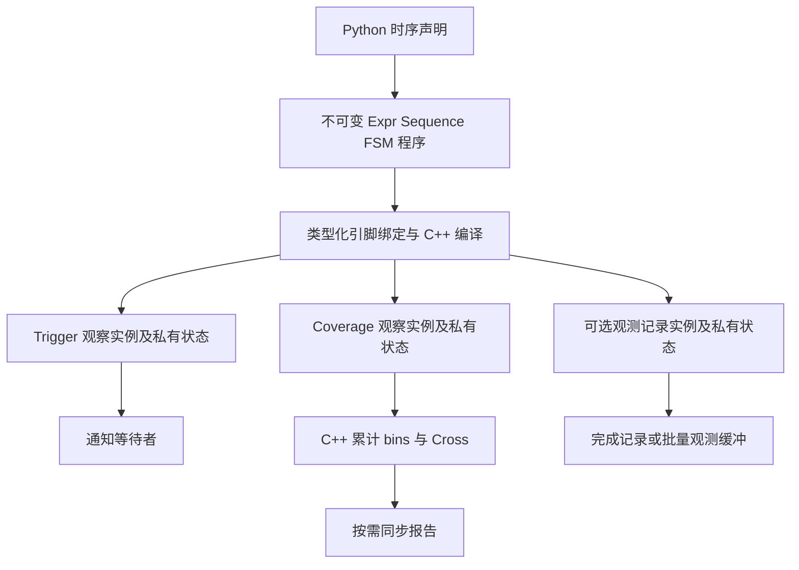
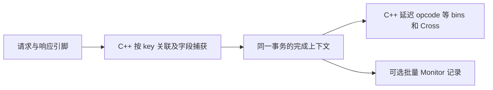

# Coverage v2 共享时序程序与 C++ 执行设计草稿

状态：讨论稿，2026-10-08，目标接口尚未实现。设计与代码实验位于 `/tmp/xreactor-coverage-v2-ob2uhbua/xreactor` 的 `coverage-v2` 分支。本文更新时序覆盖方向；现有运行示例仍以[实验指南](../../docs/guides/coverage-v2.md)为准。

**同一份时序定义可以用于等待、持续计数或生成观测记录。C++ 负责连续采样、时序推进和计数；Python 负责类声明、类型检查、绑定和报告。** 新设计按覆盖语义向 xcomm 提出引擎需求，现有 ABI v3 用来说明实现起点。当前交付范围与后续讨论项按下面的优先级区分。

## 当前范围

当前优先推进三项：

1. **长 Execution 内的程序回收**：程序不再被使用后，其表达式节点、常量及缓存可以安全释放；仍在使用同一程序的观察者继续运行。
2. **每个 bin 的完整时序程序**：独立支持 Expr 事件策略、完整 Sequence 和选定 FSM 终态，复用已有时序语义。
3. **完整的表达式类型语义**：明确位宽、signed/unsigned、cast、扩展、截断、运算结果和未知值规则，再使 Python/native 对齐。

“程序与观察实例彻底分离”降为内部实现选择，不作为单独的公共 API 或大重构交付。需要保证的是不同观察者的计数、历史和取消互不干扰；当前已有 MatchState 隔离。为了安全回收、复用而做多少拆分，由实际实现决定。

统一过程诊断、大规模执行索引及专项规模优化后排。基本的非法定义报错、状态上限和资源清理仍属于上述功能的正确性要求。

字段捕获与动态 key 关联保留为待讨论项，不列入当前三项交付。下面相关章节描述可能的能力目标，不能据此推断本轮必须实现原生事务引擎。

## 从同一个时序定义理解 trigger 和 coverage

ProtocolBundle 直接复用已有 Bundle，是项目对 request/response 字段的类型化声明；叶子仍为原始 XData。字段注解提供补全，signal_expr 复用既有 SignalExpr/BoundSignalExpr 建立表达式，不新增 BoolSignal/UIntSignal 或独立引脚容器。完整表达式类型语义补到公共 IR。已实现协议示例也使用 Bundle 子类，见[复用清单与能力缺口](trigger-bins/README.md)。

假设一个接口同时最多只有一笔未完成请求，定义“请求握手后，接下来 1 至 4 拍出现响应握手”：

```python
@xtrigger(sample=RisingEdge("clock"))
def roundtrip(pins: ProtocolBundle):
    return Sequence(
        Wait(signal_expr(pins.request.valid) & signal_expr(pins.request.ready)),
        Within(1, 4, signal_expr(pins.response.valid) & signal_expr(pins.response.ready)),
    )
```

Trigger 使用这个定义等待一次完成：

```python
await roundtrip(pins)
```

Coverage 使用相同定义持续累计完成次数。以下是拟议接口，没有实际导出：

```python
class RoundTripPoint(TemporalCoverPoint[ProtocolBundle]):
    within_four_cycles = roundtrip


@covergroup(schema_id="protocol.roundtrip")
class ProtocolCoverage(SignalCoverGroup[ProtocolBundle]):
    roundtrip = RoundTripPoint()


coverage = ProtocolCoverage(instance="dut.protocol")
coverage.bind(
    pins=pins,
    sample=RisingEdge(pins.clock),
    strategy="native",
)
# Execution 仍负责启动、同步与释放这个 coverage 实例。
```

Point 的类属性给 bin 命名，Group 的类属性给 point 命名，`roundtrip` 对象引用说明匹配什么过程。用户不用重写时序表达式或手动给 bin 加计数，也不用为每个 bin 编写循环 await 的任务。

`SignalCoverGroup[P]` 的 P 是现有 Bundle、协议接口或 DUT 根对象；当前 `CoverGroup[S]` 的 S 是不可变观测样本。两者需要区分 live 输入与快照输入，但只增加声明/绑定分支，复用同一 CompiledGroup、CoreCoverGroup、collector、计数和报告。候选名称可以调整，不要求新建 runtime 或特定引脚容器。既有值覆盖和 Python 事务 sample 路径继续使用 `CoverGroup[S]`。

`@xtrigger` 提供时序声明入口。其声明对象保存程序、参数和采样信息，绑定后才创建观察实例。覆盖编译器读取这份定义，不调用它的 await，也不接收已经 arm 的 watcher。装饰器的静态返回类型应明确区分声明对象与绑定后的 trigger，保留 ProtocolBundle 的参数类型和 IDE 补全。

## Bin 与 trigger 共用匹配定义

Bin 与 trigger 在“什么条件或过程算命中”这一层可以使用同一份定义。覆盖声明允许直接引用 xtrigger，普通情况下自动登记为 normal、at_least=1 的 bin。以下仍是候选语法：

```python
class RequestPoint(TemporalCoverPoint[ProtocolBundle]):
    read = read_accepted
    write = write_accepted
```

read_accepted 和 write_accepted 是已有 xtrigger 声明，包含明确的采样与事件策略。需要覆盖配置时再包装同一份定义：

```python
class RepeatedRequestPoint(TemporalCoverPoint[ProtocolBundle]):
    read = read_accepted
    write = Bin.pattern(write_accepted, at_least=10)
```

所以 Bin.pattern 是可选的覆盖配置，不强迫用户为每个时序条件多写一层包装。编译器按 point 槽位和属性名登记覆盖身份；同一个 xtrigger 被多个 bin 引用时，不把名称、计数或 owner 写回共享定义。

下一步如何修改临时分支，具体接口、类型检查草稿及分批验收见[分支实施方案](trigger-bins/README.md)。其中补充了参数绑定、采样冲突、重复引用、继承和 FSM 终态选择的规则。类型草稿不提供运行时实现。

Trigger 使用匹配结果通知等待者；bin 使用匹配结果累计覆盖计数，并附带阈值、normal/ignore/illegal 等策略。Point 组织相关 bins，Group 组织 points 和 Cross。执行层共用 matcher，声明层保留可审核的归属关系。

普通 Bin.values/range/mask 也可以降低为共用的表达式匹配，不另建覆盖专用时序算法。但“每次采样成立”与“进入条件时”是两种策略：ready 连续三拍为 1，值 bin 计 3；enter trigger 只通知 1 次。直接引用 xtrigger 时保留其显式事件策略，编译结果必须显示它，不能把普通值 bin 的逐 sample 语义改成默认 enter。

## 当前 C++ 已经有的关联

本机 xcomm 源码在 `/home/xyl/picker/dependence/xcomm`，隔离 binding 构建在 `/tmp/xreactor-coverage-native-build`，coverage ABI 为 3。实现关系如下：

| 位置 | 当前作用 |
| --- | --- |
| `include/xspcomm/xtrigger.h` 的 `XTriggerEngine` | 同一个引擎包含 watcher、表达式、Sequence/FSM 和 coverage 描述符 |
| `src/xtrigger.cpp` 的 `AppendHit` | 普通 watcher 产生通知并解除 armed；带 coverage 的 watcher 调用 SampleCoverage，继续观察 |
| `AdvanceSequence` 和 `AdvanceFsm` | trigger 与 coverage 共用步骤或状态推进函数 |
| `AdvanceCoverageAttempts` | 共享程序，每个并发匹配保存独立 MatchState |
| `SampleCoverage` | 在 C++ 准备 bins、Cross 和计数增量后提交累计值 |
| `AttachCoverage` | 把整组覆盖定义附到已有 handle；当前 bin.steps 只接受 Wait/Next |
| `CoverageSnapshot` | 返回累计计数和可选诊断，不依赖普通命中逐次通知 Python |

Python 的 [coverage adapter](../../src/xreactor/_coverage_runtime.py) 已把 `Bin.transition(a, b, c)` 降低为 `Sequence(Wait(value == a), Next(value == b), Next(value == c))`，并调用 [backend 的时序降低入口](../../src/xreactor/backend.py)。

所以当前覆盖率热路径确实在 C++，但还有 Python 手动 sample 和 Python fallback 路径。类声明前端不改变这个事实。目标是在已有共用基础上整理编译与观察接口，并扩展 C++ 能力。

2026-10-08 的 binding 探针使用相同 Wait/Within 程序注册两份独立观察状态：普通通知一次时 coverage 计数为 1；释放通知观察后，再运行四个周期，coverage 计数变为 3，没有新增通知。注销后 ActiveCount 为 0。相同程序放入 ABI v3 的 bin.steps 被明确拒绝。原始结果保存在 `/tmp/xreactor-coverage-v2-ob2uhbua/pattern-native-baseline.json`。这些结果验证当前机制，不代表本文候选 API 已交付。

## 共享程序与独立运行状态



程序保存“要识别什么”，观察实例保存“已经匹配到哪里”和“完成后做什么”。可以共享程序、无状态表达式节点及编译结果；不同注册、不同 coverage 实例的起点、历史、计数和取消状态独立。

一个 trigger 被取消或成功返回，不会删除另一个 coverage 实例的历史。coverage 持续观察整个 Execution，无须 Python Rearm；被动观察不额外生成时钟需求。普通覆盖命中只更新原生计数，不填充通知缓冲，不迫使 RunUntil 返回 Python。

观测记录是可选输出。原生完成记录可以直接交给原生 coverage 分类；只有 Monitor 确实需要消费数据时才按有界批次返回 Python。持续计数本身不创建 Python 事件、对象或回调。

## Point 需要区分值分类和过程完成

| 定义 | 观察什么 | 推荐计数单位 |
| --- | --- | --- |
| `CoverPoint[int/bool]` 的 values/range/mask | 当前有效 sample 中的值 | 每个 sample 中每个命中 bin 加 1 |
| 现有 `Bin.transition` | 一个值在连续 sample 中的变化 | 完成 sample 中命中 bin 加 1 |
| `TemporalCoverPoint[P]` 的 `Bin.pattern` | 完整表达式事件、Sequence 或选定 FSM 终态 | 每个完成的匹配实例加 1 |
| `CoverGroup[Transaction]` 的字段 bins | 已完成事务的属性 | 每个完成事务 sample 一次 |

TemporalCoverPoint 表示过程事件，不需要伪造一个 bool 字段。Bin.pattern 返回带引脚根类型的 PatternBinRule[P]；不能混入普通值 Point 的 BinRule[T]，也不能绑定到另一个协议根类型。类继承、同名 bin 覆盖和编译后冻结沿用声明层规则。

本轮推荐 pattern bin 按完成匹配计数。若两个活跃匹配在同一拍完成，bin 加 2。报告分别展示观察周期数和完成次数，不能暗示两者相等。现有相邻 transition 的每 sample 计数保持其既有含义。覆盖率达标仍按具名 bins 和各自阈值计算，不把周期数当作功能覆盖率的分母。

表达式模式保留明确的事件策略：enter 统计进入，each_sample 统计每次成立，change 统计有效变化。Bin.pattern 复用声明中的策略并在展开结果中显示它；普通 Bin.values 不隐式套用默认 enter。Sequence/FSM 本身产生离散完成事件。

FSM 有多个终态时，bin 必须选中要统计的终态，或明确声明统计全部终态。当前先复用 FsmSpec/State.trigger 的字符串终态和 backend 的 ID 降低；不为 coverage 单建终态 DSL。C++ 完成结果保留 terminal ID，不能丢弃后把成功与失败当作同一个含糊的命中。

## 时序语义与采样条件

`sample=RisingEdge(pins.clock)` 说明在哪些稳定时刻观察；bin 内的 Sequence 说明跨这些时刻识别什么。引脚组中的路径由编译器从 IR 收集并绑定，不要求用户再次列出 pattern 的所有输入字段。外部稳定端口身份进入契约。

一个时钟域内每个匹配实例每次采样最多推进一步。因此 Within 的距离是采样间隔，Within(0, 4) 也不表示同拍执行第二步。每拍采样时，这个距离才对应硬件周期；稀疏事件采样时应按事件间隔解释。原生 elapsed_cycles 使用绑定时钟计数，不能用稀疏 sample 次数替代。

步骤保留已有未知条件处理：Wait 遇到未知条件不启动，Next 视为失配，Within 继续计时但未知条件不完成，Hold 中断连续保持。不能为了 coverage 另写一套与 trigger 不一致的步骤语义。表达式自身的已知性随 typed IR 一起规范：当前实现保守检查依赖信号，新按位运算能够消去未知位时应读取运算结果的已知位，trigger/coverage 同步采用同一规则，见[类型提案](trigger-bins/README.md)。条件未知诊断和普通值 point 的 unknown 计数需要分别说明，实施前冻结字段和聚合方式。

group/point gate 关闭时抑制本次匹配并清除对应历史；reset/abort 在推进前生效，阻断跨复位拼接。各 bin 的窗口、重叠策略、活跃上限和终态选择必须可审核，不能从引擎实现中隐式推断。

本轮沿用已有 AdvanceCoverageAttempts 的重新启动顺序。默认 non-overlap、最多一份活跃匹配；采样开始时已有匹配，则本次只推进它，即使完成，也到下次采样才允许新起点。overlap 模式先推进旧实例，再检查本次的新起点，必须提供有界 max_active。每份实例每次采样最多推进一步；容量耗尽报错并标记采集不完整，不能悄悄丢弃起点。不额外引入同拍重新启动的新策略。

## Cross 必须有同一份观测上下文

现有值 point 的 Cross 使用同一次 sample 的 normal-bin 命中集。两个独立 pattern 在同拍完成，不足以证明它们属于同一笔事务；把命中集直接相乘可能生成虚假的功能组合。

目标规则如下：

- 共享同一 sample 的值 points 继续按当前规则 Cross。
- 共享同一完成记录的事务属性可以 Cross；同拍完成两笔事务时分别统计。
- 独立 pattern 的 Cross 不隐式按同拍配对。需要先声明共同的过程或关联上下文，编译器拒绝上下文不明确的 Cross。

当前三项交付中不实现新的完成上下文。因此初版直接拒绝包含 TemporalCoverPoint 的 Cross；现有值 points 和 Python 已完成事务 sample 的 Cross 继续使用。不能用“恰好同拍”绕过这个检查。

例如统计“读请求的延迟”时，需要捕获请求起点的 opcode，和同一请求完成时计算出的 latency 一起分类。不能在响应拍重新读取已经变成下一笔请求的 opcode。C++ 完成上下文必须支持这种字段取值，Python 不应为此逐拍介入。

## 向 C++ 引擎提出的需求

PatternProgram 与 Observer 是一种可选的内部组织方案。以下名称用于讨论职责，不要求当前交付新增全部接口，也不要求先完成彻底分离再实现覆盖能力：

```text
CompilePattern(program_ir, bindings) -> ProgramHandle
Observe(program, observation_options, consumer) -> ObserverHandle
AttachCoverage(observer, coverage_plan)
SnapshotCoverage(observer)
ResetObserver(observer, counters)
Disarm(observer)
```

普通覆盖组以稳定 phase 创建观察源，内部每个 pattern bin 引用 ProgramHandle 并持有私有匹配状态。使用复杂时序作为整组采样源也是明确的另一种观察配置。程序 ID、观察 handle、计数器 ID 各自有生命周期，不能混用。

| 需求 | C++ 行为 | Python 编译器职责 |
| --- | --- | --- |
| 共享程序 | Expr、Wait/Next/Within/Hold、FSM 使用公共程序表示和推进函数 | 从现有 xtrigger 声明提取、验证并规范化 IR |
| 每个 bin 的完整时序 | bin 引用独立程序及私有状态，支持窗口和 FSM 终态 | 编译 PatternBinRule，不把所有模式塞进 group trigger |
| 不同 consumer | 通知、持续计数、记录输出分别注册，互不取消 | 选择明确用途；coverage 不构造循环 await 任务 |
| 原生 pattern point | 显式 point kind，无须单一 XData 或虚构 bool signal | 区分值分类点与过程事件点，检查规则归属 |
| 完成结果 | 保留完成数量、tick、phase、attempt ID、terminal ID 和捕获槽位 | 定义 bin 计数单位、Cross 上下文和诊断 |
| 原生字段来源 | 值可来自 XData、捕获槽位、受支持的完成派生表达式 | 校验位宽、符号和逻辑字段类型 |
| 有界状态 | 每个观察实例规定活跃上限，容量和计数溢出明确失败 | 在计划中显示状态预算和错误位置 |
| 生命周期 | 取消、clear_history、reset、快照和退出相互隔离 | Execution 管理启动、同步和释放 |
| 可审核能力 | ABI 和能力查询；编译失败返回稳定原因 | 严格 native 拒绝能力缺失，auto 明示整组回退 |

需要扩展的地方包括当前 XCoverageItem 必须携带单个 signal 的约束、XCoverageBin 只接受相邻 steps 的校验、FSM 程序和终态表示、完成上下文及计数提交。仅放开 Within/Hold 校验不足以完成这个设计。

引擎内部可以逐步整理现有 Watcher/CoverageState，无须一次性重写。对外能力与描述符升级使用新的 ABI 版本，暂称 v4，最终版本由 xcomm 交付确定。用户项目处于开发阶段，本轮不要求旧 API 迁移或兼容层。

## 原生事务关联与捕获

状态：待讨论，不属于当前三项交付。

多笔请求并发时，简单的 Wait(request)/Within(response) 会把任意响应当作结束条件。目标引擎需要按动态 key 关联，而不仅仅保存多份相同条件的进度。

例如观察到下面的实际握手：

| 周期 | 请求 | 响应 |
| --- | --- | --- |
| 10 | tag=1，read | 无 |
| 11 | tag=2，write | 无 |
| 12 | 无 | tag=2 |
| 15 | 无 | tag=1 |

字段捕获就是在第 10 拍保存 tag=1、read、起始周期=10，避免第 15 拍重新读取已经改变的请求引脚。动态 key 关联就是用响应携带的 tag 找回对应请求：第 12 拍找到 write，延迟 1；第 15 拍找到 read，延迟 5。tag 的具体数值来自运行中的硬件，不能只在定义里写死 tag==1。

只有需要起点字段、请求响应延迟或多笔未完成事务配对时，才需要这些能力。固定条件的时序识别可以直接使用现有 Sequence/FSM，不必为了统计一个过程引入事务关联。

若后续选择原生实现，C++ 需要执行：

1. 请求 valid & ready 时捕获 tag、opcode、起始时钟计数，登记有界 pending 状态。
2. 响应 valid & ready 时按 tag 查找对应状态，只完成该 tag 的请求。
3. 在完成上下文中计算 elapsed_cycles、结果比较和乱序标志，保留起点捕获的 opcode。
4. 把完成上下文直接交给 TransactionCoverage 的值 bins 与 Cross；Monitor 需要事务时再输出有界记录批次。



必要的 IR 能力包括 CaptureSlot、捕获值比较、时钟差值和按 key 查找。槽位带类型和位宽，生命周期属于对应匹配。表达式计算在显式的信号与捕获上下文中进行，不调用任意 Python 函数。

keyed 模式和广播式时序匹配是两种明确语义：一个响应完成同 key 的请求，不广播给其他 tag。重复活跃 key、未知响应、超时和缓冲容量耗尽都有可配置且可审核的处理策略；同拍响应释放旧 tag 后可以接受该 tag 的新请求。多时钟域关联需要额外时间模型，不能直接相减后称为周期延迟。

逻辑上的 CompletedTransaction 仍可使用 dataclass 表达字段契约。native 路径将其字段绑定到完成上下文中的槽位，不需要每笔先创建 Python dataclass 再送回 C++。已有 Python collector 可以作为参考实现和需要复杂软件模型时的观察路径。

这一部分提出完整的原生能力需求。Capture/关联 DSL 的 Python 写法、终态引用、超时策略和记录类型将在实现前继续讨论，不把当前手写 collector 当作最终高频实现限制。

## 编译与审核

声明编译先处理继承、bin 引用、输入根类型和计数语义，再生成稳定 schema。绑定阶段检查所有实际使用的引脚、位宽、采样域、捕获槽位及能力，然后为所属引擎生成程序和观察实例。

编译结果需要解释：每个 bin 的时序、源引脚、采样阶段、完成单位、重叠和容量、终态、捕获来源、Cross 上下文及预计状态规模。审核者应能看出“匹配什么”和“完成后统计哪些值”，不用阅读数值描述符。

契约指纹包含规范化程序、冻结参数、采样域、enter/each_sample/change 策略、gate/abort、重叠及重新启动策略、捕获类型、key 策略、计数单位和稳定来源身份。Python/native 的执行选择不改变同一观测定义的身份。root ID、内存地址和源码位置不进入可交换报告的语义指纹。

纯程序可以在兼容绑定内缓存。已经绑定的原生程序引用所属引擎和信号，不能跨 backend 使用；观察状态和计数始终不缓存为共享对象。程序需要明确引用计数或 Execution 所有权，释放观察实例后再安全释放程序。

## 实施与验证顺序

按当前范围推进程序生命周期、表达式类型规则和独立 pattern bins。三项可以分别评审；程序内部抽象只做实际需要的拆分，不设“先重构整个观察引擎”的前置阶段。

- 程序回收验证长 Execution 中反复创建与释放程序的资源增长，同时核对共享程序的活动观察者不受影响、旧句柄不能作用于新资源。
- 类型语义验证负数、边界值、不同位宽、signed/unsigned、cast、扩展、截断及未知值的 Python/native 一致性。
- 每个 bin 的时序验证完成 tick、终态、窗口边界、同拍多个完成、gate/abort、reset、取消和容量行为，确保历史与计数按实例隔离。

普通 count 命中继续留在 C++，不增加逐次 Python 回调或 RunUntil 返回。这属于当前执行方式的要求，不扩展为本轮大规模索引、统一过程轨迹或完整性能矩阵项目。

字段捕获、动态 key 关联及原生完成记录待用例和语义进一步明确后，再单独确定实现范围。

本设计配有接口和严格类型检查草稿，尚未实现 Bin.pattern、TemporalCoverPoint、SignalCoverGroup 或新的 C++ ABI；前一轮 944 项通过记录仍属于已实现实验，不作为本设计新增能力的验证结果。
