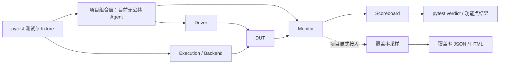

# 验证流程实现进展与下一轮准备

> 后续变更：人工 pytest 功能标签、对应插件和完成率报告已移除。本文相关数字和
> 插件行为仅保留为当时的审查记录，不代表当前功能覆盖。运行命令与当前使用方式见
> [移除记录](coverage-without-test-tags-2026-09.md)及各项目 README。

日期：2026-09-29。按 Driver → Monitor → Agent → Scoreboard → 覆盖率收集 → pytest
框架收集 → 仿真运行管理的顺序审计当前代码、测试和文档。

本文保留修复前的审计事实与 311 项基线。后续已完成 Monitor/pytest 修复、
SamplingMonitor 与组合配方，当前结果见[逐项修复评审](verification-flow-fixes-2026-09.md)。
下文“尚未修复”“当前行为”均指本次审计时点，不代表后续代码状态。

本轮只形成现状分析、复现证据与下一轮建议，不修改运行实现。用户已明确准备
下一轮实现计划，详见[工作包与验收](../delivery/verification-flow-next.md)；新增 Agent、
资源接口等尚未据此实施。

## 总体判断

当前已经能完成单时钟事务验证闭环，组件之间的组合与报告异常路径还没有完整收敛。
不能把现有 311 项测试通过理解成所有结束和中断场景均已覆盖。

| 顺序 | 层次 | 当前状态 | 主要边界 |
| --- | --- | --- | --- |
| 1 | Driver | 通用输入生命周期可用 | 六个公开类；资源适配仍在讨论，协议驱动由项目实现 |
| 2 | Monitor | 采样机制可用，通用组件层不足 | 最小契约加 ReadyValidMonitor；关闭/失败不能通知已有 recv 等待者 |
| 3 | Agent | 尚无公共实现 | 环境组合由项目对象、fixture 和 context manager 完成 |
| 4 | Scoreboard | 通用事务检查闭环可用 | 独占 Monitor；明确支持的关联方式与预算，不承担整个环境生命周期 |
| 5 | 覆盖率收集 | 计数、合并、报告可用 | 采样接入与异常时保存仍由项目组织 |
| 6 | pytest 框架收集 | 功能点插件可用，提前停止有误报 | -x 可能遗漏未运行实例并误判功能点完成；并行 worker 汇总尚无实现 |
| 7 | 仿真运行管理 | Execution 单域运行内核可用 | DUT/Backend、运行参数及产物由 fixture/项目脚本管理 |

上述顺序是审查顺序，实际职责不是一条单向流水：Agent 组合组件，pytest 承载测试，
Execution 支撑时钟与任务运行；Scoreboard 判断正确性，覆盖率记录采样，两者有独立目的。



图中的覆盖率连线不表示已有广播 API。当前 Scoreboard 独占绑定 Monitor 的 recv；
不能让另一个覆盖率协程也 recv 同一队列，否则会分走本应检查的事务。

## 1. Driver

实现入口：[components.py](../../src/xreactor/components.py)、
[sync_drivers.py](../../src/xreactor/sync_drivers.py)、
[async_drivers.py](../../src/xreactor/async_drivers.py)、
[transfers.py](../../src/xreactor/transfers.py)。

目前六个类的职责已分开：

```text
Driver
└── SignalDriver
    ├── SyncDriver
    │   └── SyncSingleCycleDriver
    └── AsyncDriver
        └── AsyncSingleCycleDriver
```

- Driver 只约定 send 返回可等待的完成事件，以及 close。
- SignalDriver 声明并保护底层信号 ownership；不决定协议时序。
- SyncDriver 执行调用方等待的输入过程。AsyncDriver 管理后台提交、容量和清理。
- AsyncDriver.send 调用即提交，在输入接受时自动完成；submit 等待响应关联方完成。
- max_active 控制输入过程的并发，resource_lock 控制具体资源占用；两者都不推断 RTL。
- 未接受输入可撤销；取消等待者不撤销输入；异常和外部取消后的清理有回归。
- 独立 ReadyValidDriver 已移除。后续协议实现选择 Sync/Async 模板，在 _drive_one 中定义时序。

验证包含 Driver 单元测试、阶段交接和 66 项流水集成测试，覆盖 memory/native 实际
信号采样、接受顺序、多批次、响应乱序和关闭清理。测试集合相互交叉，不把这些计数
相加当成独立能力数。

仍需处理的是易用性边界：资源名声明、占用者诊断和作用域表达尚未形成领域接口；
capacity 满时直接失败，没有等待容量的提交入口。后者是当前明确行为，不等同于
需要立即新增公共方法。资源封装的候选边界见[资源讨论稿](../architecture/driver-resources.md)。

## 2. Monitor

实现入口：[Monitor 契约](../../src/xreactor/components.py)、
[monitors.py](../../src/xreactor/monitors.py)、
[subscriptions.py](../../src/xreactor/subscriptions.py)。

已有能力：

- Monitor 的 start / recv / aclose 最小契约。
- ReadyValidMonitor 的同步 capture、不可变 payload、接受时刻交付。
- 有界 lossless/latest 队列和溢出失败。
- @on 持久订阅在交付 handler 前重新布防，避免每次重等造成采样空窗。
- MemoryBackend/native XClock 均验证了 Python 驱动、DriveStable 捕获和 rising 接受的关系。

通用层仍不完整：协议无关示例自己定义 Queue Monitor，尚无可复用的通用采样与交付
模板；Monitor 基类没有统一的异步 context manager、关闭结果和终止等待语义。
Driver 已有通用模板，Monitor 目前还没有对应程度的复用。

本轮实际复现：

| 场景 | 当前行为 | 判断 |
| --- | --- | --- |
| recv 已开始等待，随后 aclose | recv 仍 pending | 关闭没有通知接收方，需要明确结束语义 |
| decoder 抛 ValueError | pump 失败，但 recv 仍 pending | 仅等待 recv 的测试可能挂起，失败传播不完整 |
| 关闭前保留一条未读数据，再 start | 新生命周期读到旧 tick 的数据 | 重启缓冲策略未明确，不能假定每次 start 都是空队列 |

前两项应优先修复。第三项需要先决定禁止重启、清空旧数据还是显式保留；不能在未定义
契约时把任何一种行为默认为用户期望。Scoreboard 当前自行取消消费任务，缓解了其
绑定路径中的清理，但不能替代 Monitor 自身对直接使用者的保证。

## 3. Agent

源码中没有验证组件意义上的公共 Agent 类。设计文档中“由 agent 生成”的 agent
指编写项目代码的助手，不是已经实现的硬件验证 Agent。

目前组合发生在：

- 用户的 pytest fixture 和 async context manager；
- 流水示例内同时创建 Driver、Monitor、Scoreboard；
- CacheDriver、E203Harness 等项目对象。

这些用法提供了具体环境组合，但没有统一的 active/passive 模式、组件配置入口与
失败后的反向清理契约。因此不能把 Agent 标为“已实现”。

如果下一步引入 Agent，首先要回答：它持有哪些组件、谁启动 Monitor、Scoreboard
绑定后谁可以消费、谁负责 finish。现有 Scoreboard 已拥有绑定 Monitor 的启停和
独占消费，Agent 不能再次启动/关闭同一 Monitor，或者建立第二个消费循环。

建议先用一个协议无关的项目组合示例验证生命周期，再决定是否抽公共类。Agent 的
候选职责是组件组合与生命周期，不加入另一套任务调度，也不把 TaskGroup 当作日常
验证接口，不附带 UVM factory、phase、objection 或回归管理系统。

## 4. Scoreboard

实现入口：[scoreboard.py](../../src/xreactor/scoreboard.py)、
[_scoreboard_matching.py](../../src/xreactor/_scoreboard_matching.py)。

已有直接值比较、结构化差异与自定义 compare；异步模式支持 FIFO、key、固定延迟
关联。clock 与响应超时显式提供，固定延迟窗口与截止周期判定已有回归。

事务收尾已具有明确边界：

- drain 等调用前的提交水位，使用周期预算；
- finish 封闭提交、排空、有限观察、检查残余输入输出；
- aclose 检查与清理，不隐式无限等待；
- Monitor 跨批次保持运行，由绑定 Scoreboard 独占消费与管理；
- 背景错误从句柄、drain、finish 或退出传播，同一已观察失败不重复报告；
- 默认保留累计计数与活跃表，不保留完整历史。

现有 37 项 Scoreboard 单元测试、7 项 native 生命周期测试及流水集成覆盖了关键
接受/响应竞态、重复 key、漏响应、额外响应、取消和异常关闭。

目前的缺口主要在环境接入：coverage 尚无与其独占 Monitor 消费契约配套的标准
采样配方，统计没有自动绑定到 pytest 产物。应先定义采样点与导出路径，不为了
补这些接线问题重做 Scoreboard 关联机制。

## 5. 覆盖率收集

实现入口：[coverage.py](../../src/xreactor/coverage.py)、
[coverage_report.py](../../src/xreactor/coverage_report.py)。

已具备 covergroup/point/cross、values/ranges/masked/array bins、ignore/illegal、
iff、命中门槛、覆盖率断言、JSON 保存和按 schema 合并。采样有原子更新检查，
details=False 提供不构造命中详情的路径。报告支持 functional coverage、LCOV
line coverage 和功能点结果的独立展示，不把这些百分比混为一个指标。

17 项 coverage 单元测试和 3 项报告测试提供当前证据；e203 已有真实 DUT 集成和
性能记录，但本轮没有重跑 RTL 或重测性能，历史数字仍以其原报告为准。

“覆盖率引擎”已可用，“自动收集流程”仍需项目接线：

- CoverGroup.sample 由调用方调用，不会自动订阅所有 Monitor。
- 采样需要明确基于输入接受、DUT 观察，还是已经核对完成的事务。
- 已绑定 Scoreboard 的 Monitor 不能通过第二个 recv 消费者收集覆盖率。
- pytest 插件没有自动保存 CoverageDatabase，也没有通用 LCOV 导出 hook。
- 失败时保存、每用例文件名和跨运行合并由项目控制。e203 示例的 functional 产物
  在 run_campaign 成功返回后写出；中途失败并不保证同样的 functional 产物存在。

优先准备一个显式采样、失败也保存、每用例隔离文件的完整示例；不要先增加广播流
或独立观察总线。LCOV 仍由 simulator 工具导出，框架报告层负责读取与展示。

## 6. pytest 框架收集

实现入口：`pytest_plugin.py`（已移除）、
`feature_report.py`（已移除）、
[插件入口配置](../../pyproject.toml)。

这里分开两个含义：pytest 本身收集 test item、执行 fixture；XReactor 插件将 item
映射为功能点并收集结果。插件不是另一个测试执行器。

已实现 @pytest.mark.feature、计划 JSON、参数化实例聚合、setup/call/teardown
结果采集、终端摘要和 JSON。执行率、执行中通过率、计划完成率分别显示；未在
测试中出现的计划项保持 NOT_RUN。已有四项功能点测试，其中一项实际启动 pytest
子进程，验证 PASS / XFAIL / 计划未运行项。

本轮发现现有测试未覆盖的边界：

1. **提前停止误报完成。** 同一功能点有两个已收集的测试，第一项通过；中间另一
   测试失败导致 -x 停止，第二项没运行。当前功能点被标为 PASS，完成率 100%。
   register_item 只记录映射，finish 只汇总已产生 report 的 item，未执行项没有进入
   聚合分母。pytest 进程仍正确退出失败，但功能点产物会误报完成。
2. **strict XPASS 分类不一致。** pytest 报 [XPASS(strict)] 并失败，插件把它记作
   FAIL，没有单列 XPASS。这里没有把失败变成功，但丢失了预期失败意外通过的信息。

pytest-xdist 的 controller/worker 汇总 hook、worker 独立产物路径和 rerun 合并规则
尚未实现或验证，不应宣称支持。collection error、KeyboardInterrupt、setup/teardown
各类结果也需要独立端到端用例，不能只根据代码分支推定覆盖完整。

下一轮应先补齐“已收集但未完成”的状态，再讨论自动产物与并行扩展。

## 7. 仿真运行管理

实现入口：[execution.py](../../src/xreactor/execution.py)、
[_asyncio_observer.py](../../src/xreactor/_asyncio_observer.py)、
[backend.py](../../src/xreactor/backend.py)、[reactor.py](../../src/xreactor/reactor.py)。

单次运行已有完整基础能力：

- Execution 管本次 Reactor、推进任务、watcher、subscription 与 backend lease。
- asyncio 保持唯一调度器，按 Execution 观察即时回调，当前就绪工作收敛后才推进时钟。
- 原生 Lock/Queue/Event 的级联交接、取消和 DriveStable 采样已有正式回归。
- paused 可冻结仿真时间；external_task 显式划分外部库工作，生命周期仍由调用方负责。
- batch/quantum 控制推进与让出，max_settle_rounds 对不收敛进行有界失败诊断。
- 46 项观察器集成测试、18 项交接测试和 runtime/backend 测试验证主要资源清理路径。

当前不属于 Execution 的职责：DUT 构造和 Finish、Backend 最终 close、设计初始化、
seed、波形和输出目录、整个 pytest session 的产物保存。用户 fixture 和项目脚本
已经可以组织这些动作，但没有统一的框架运行记录或产物 fixture。

限制需保持明确：

- 主要验证单 XClock/domain；多实例隔离不等于多时钟共同时间轴。
- 支持的观察入口是 asyncio.BaseEventLoop，其他 loop 需要独立适配验证。
- 收敛预算不是整个测试的周期或墙钟超时；Scoreboard 周期预算与外层运行时限职责不同。
- 阻塞在任意外部 Future 的宿主任务不由 Execution 擅自取消；组件应负责自己的
  等待者失败传播。本次 Monitor 挂起问题应在组件边界修复。
- 工作进程并行、seed 矩阵、重试、回放、回归管理并未提供，也不据本次分析自动纳入范围。

## 已准备的下一轮工作顺序

| 优先级 | 工作包 | 可评审的结果与验收 |
| --- | --- | --- |
| P0 | Monitor 终止与失败传播 | 关闭/失败唤醒全部已有 recv 等待者；明确缓冲与重启策略；原子采样、任务与 watcher 清理不退化 |
| P0 | pytest 提前结束统计 | -x、maxfail、中断后未完成实例不被忽略；strict XPASS 分类明确；pytest exit code 与功能点状态分别正确 |
| P1 | 通用 Monitor 与组件组合 | 先冻结协议无关采样/交付契约；给出 Driver+Monitor+Scoreboard 的单一所有者示例，再决定 Agent 是否需要公共类 |
| P1 | 覆盖率与 pytest 产物接入 | 显式采样点，单消费者不丢事务，成功/失败均保存，每个 test item 输出路径隔离，三类指标独立 |
| P2 | 运行配方与边界验证 | fixture 管 DUT/Backend/Execution 释放，记录 seed/参数/产物；按需求扩大 loop、版本与长时间运行验证 |

资源锁适配与 Agent 的公共命名仍需讨论。既有约束继续有效：不新增调度器，不让
日常用户通过 parallel/TaskGroup 开启流水，不推断具体硬件协议，不自动加入
VerificationScope、ObservationStream 或回归管理设施。

## 本次检查与复现材料

本轮全量执行：

```text
python3 -m pytest -q --require-xspcomm --junitxml=/tmp/xreactor-flow-audit/junit.xml
311 passed in 1.25s
```

Python 3.12.3，使用本地 native xspcomm；本轮未重新构建或运行真实 RTL。
严格文档构建与 git diff --check 通过。

额外探针独立于现有测试，不把复现缺口计为测试通过：

```bash
python3 design/verification/verification_flow_probe.py \
  --output-dir /tmp/xreactor-flow-audit
```

[探针源码](verification_flow_probe.py)与实测结果（本地产物：`verification-flow-probe-results-2026-09-29.json`）
记录 Monitor 关闭、错误与重启，以及 pytest failfast/strict XPASS。探针只创建自己的
任务与临时 pytest 项目，结束时清理；生产代码未修改。
